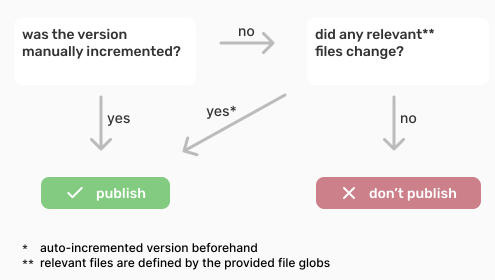
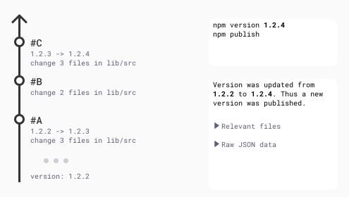
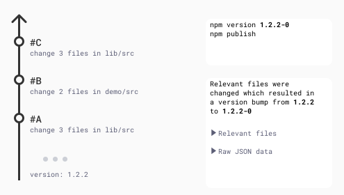
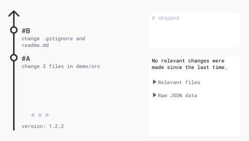

# Publish

This GitHub action takes the input of [version-metadata](./version-metadata) and based on that decides wether or not to publish a new package.
This is in part based on the provided file globs.

This action doesn't publish on its own, this is still up to you.
There are examples below showing exactly how this is done.

The decision is made using the following procedure:



## Usage

### GitHub Workflow

```yaml
- id: publish # This will be the reference for getting the outputs later on.
  uses: Quantco/ui-actions/publish@1.0.3

  with:
    # type of "increment" to use to auto-increment the version
    # currently only 'pre-release' is supported
    increment-type: pre-release
    relevant-files: '[".github/**", "lib/**"]'
    # this is the same path as the one used in version-metadata, it's only used to have a proper summary at the end, not essential to the execution flow of the action
    package-json-file-path: lib/package.json
    # when auto-incrementing this version is used and incremented
    # the reason is that the version in the package.json file can remain the same while a lot of versions are published and incrementing from the same starting point would result in collisions.
    latest-registry-version: ${{ env.CI_PUBLISHED_VERSION }}
    # the json output of the version-metadata action
    # you can of course replace version-metadata with differernt action but it needs to have the same data structure
    version-metadata-json: ${{ steps.version-metadata.outputs.json }}
```

### Outputs

- `publish`: `true` if the package should be published, `false` otherwise.
- `version`: the version that should be published
- `reason`: a markdown summary of why what decision was made (made for action summaries)

`version` is omitted if `publish` is false.
`reason` is always present.

### Situations

Let's look at the 3 following situations and what each results in



<details>
  <summary>Written description of case 1</summary>
  Let's assume you just merged a pull request into main in which you did the following things:

  - commit A
    - increment version from `1.2.2` to `1.2.3`
    - change 3 files in `lib/src/`
  - commit B
    - change 2 files in `lib/src`
  - commit C
    - increment version from `1.2.3` to `1.2.4`
    - change 3 files in `lib/src/`

  Version in `lib/package.json` was updated from \`1.2.2\` to \`1.2.4\`.
  Thus a new version was published
</details>



<details>
  <summary>Written description of case 2</summary>

  Let's assume you just merged a pull request into main in which you did the following things:

  - commit A
    - change 3 files in `lib/src`
  - commit B
    - change 2 files in `demo/src`
  - commit C
    - change 3 files in `lib/src/`

  Relevant files were changed which resulted in a version bump from \`1.2.2\` to \`1.2.2-0\`
</details>



<details>
  <summary>Written description of case 3</summary>
  
  Let's assume you just merged a pull request into main in which you did the following things:

  - commit A
    - change 3 files in `demo/src`
  - commit B
    - change `.gitignore` and `readme.md`

  No relevant changes were made since the last time.
</details>

### Example

In this example `lib/package.json` is used to get the version.
Be sure to replace `<YOUR PACKAGE NAME>` with your own package.

```yaml
# checkout, setup-node, etc. omitted

- id: version-metadata
  uses: Quantco/ui-actions/version-metadata@1.0.3
  with:
    file: lib/package.json
    token: ${{ secrets.GITHUB_TOKEN }}

- name: Determine last published version
  run: |
    echo "CI_PUBLISHED_VERSION=$(npm show <YOUR PACKAGE NAME> version)" >> $GITHUB_ENV
  env:
    # required for private GPR packages
    NODE_AUTH_TOKEN: ${{ secrets.GITHUB_TOKEN }}

  
- id: publish
  uses: Quantco/ui-actions/publish@1.0.3
  with:
    increment-type: pre-release
    relevant-files: '[".github/**", "lib/**"]'
    package-json-file-path: lib/package.json
    latest-registry-version: ${{ env.CI_PUBLISHED_VERSION }}
    version-metadata-json: ${{ steps.version-metadata.outputs.json }}

- name: publish npm package
  if: steps.publish.outputs.publish == true
  # this is called for both manually and auto incremented version changes
  # therefore you'll want to allow supplying the same option as the file already contains (--allow-same-version true)
  run: |
    echo "Publishing version ${{ steps.publish.outputs.version }}"
    npm version --git-tag-version false --allow-same-version true ${{ steps.publish.outputs.version }}
    npm publish
  env:
    NODE_AUTH_TOKEN: ${{ secrets.GITHUB_TOKEN }}

- name: Create action summary
  run: |
    echo "$SUMMARY" >> $GITHUB_STEP_SUMMARY
  env: # this indirection using environment variables is required because shells and backticks don't play nice together (string interpolation)
    SUMMARY: ${{ steps.publish.outputs.reason }}
```

## Local testing

In order to test this locally you can use the `test.sh` script.
It sets a few environment variables which are used by `@actions/core` to mock the GitHub API.
Change these variables to your liking.

```
export INPUT_TOKEN="<TOKEN>" && ./test.sh
```

The `publish/test.sh` script calls the `version-metadata/test.sh` script, that's why the token is needed even though the action itself doesns't need it.

The `MOCKING` environment variable is checked by `src/index.ts` to determine whether to use the mocked API or the real one.

## License

This action is distributed under the MIT license, check the [license](LICENSE) for more info.
